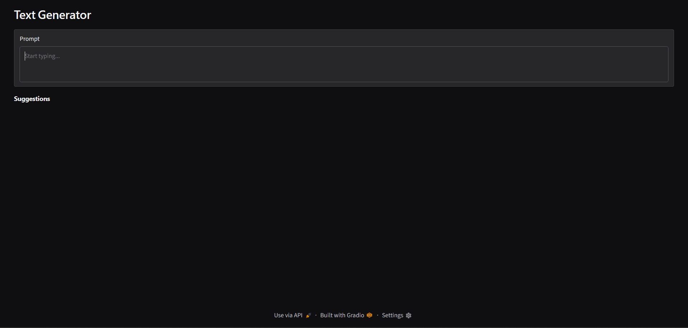

# text-generator

I built this to actually understand how autocomplete works instead of just using it. It's a small word-prediction model, trained from scratch on news headlines, wrapped in a Gradio app that suggests words while you type — kind of like the autocomplete in Google's search bar or a phone keyboard, just a lot dumber and running entirely on my own machine.



## what's actually going on here

Under the hood it's a 2-layer LSTM that predicts text one subword piece at a time. Instead of splitting on whole words, I used SentencePiece to break text into pieces (so "running" might come out as "run" + "ning"), which keeps the vocabulary small and lets the model deal with words it's never seen whole.

It's trained on AG_NEWS — about 120,000 short news articles across business, sports, sci/tech, and world news. That's also why the suggestions lean toward news-y words like "said," "reported," or "percent" no matter what you type. It's only ever read news blurbs, so that's the only voice it has.

The UI works by sampling several different continuations from the same point you've typed to, cutting each one off as soon as it hits a full word, and showing you the top candidates as clickable buttons. Click one and it appends the word and immediately suggests the next one.

## running it

Clone the repo, set up a virtualenv, and install the dependencies:

```
pip install torch torchtext torchdata gradio pandas numpy tqdm
```

Train the model first. This downloads AG_NEWS the first time (needs internet), and takes a while depending on your hardware:

```
python train.py
```

It saves a checkpoint after every epoch and prints validation loss along the way, so you don't have to wait for all 20 epochs to finish before trying it out. Once there's at least one `checkpoint.pt` sitting in the folder:

```
python app.py
```

and open the local link Gradio prints out. Start typing and five word suggestions will show up below the box.

## rough edges

This is a small model trained fairly briefly on a narrow slice of text, so don't expect it to write anything profound. Suggestions sometimes repeat or wander off into nonsense. Training longer, growing the tokenizer's vocabulary, or feeding it more varied text all noticeably help — I just haven't gotten around to all of that yet.

### Made with 🤍
